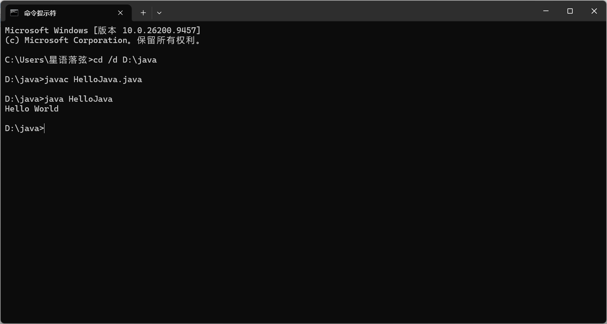
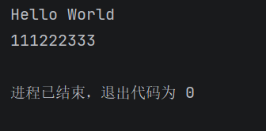
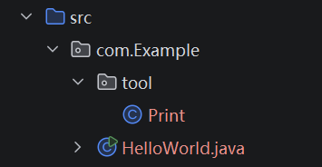
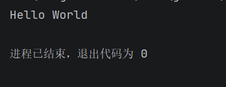

# 微光2026招新-Web后端-01

## Task 1

1. 关于JDK、JRE、JVM

   - **JVM**（Java Virtual Machine）是java代码最终运行的地方，可以类比于人的心脏（？）。在后端简介中提到，由于所有java程序都运行在JVM上，所以java有很强的可移植性，一台电脑上编写的代码可以简单在其他电脑上正常运行。
   - **JRE**（Java Runtime Environment）是java代码运行的环境。它包含了**JVM**和java的核心类库和其他java程序运行的必须组件。如果没有**JRE**只有**JVM**，那么**JVM**连最基础的`System`等命令都调不出来。沿用心脏的类比的话，**JRE**就是包括心脏在内的血液循环系统，使心脏的跳动能正常发挥作用。
   - **JDK**（Java Development Kit）由“Kit”可知这是一个java的完整工具包，里面包含了上述的**JRE**、**JVM**和一系列开发工具（例如编译器javac等），是打开即用的工具包。再沿用上面的类比，那么**JDK**就是一个可以进行各种生命活动的人了。

2. Java程序被编译和运行的原理

   - 安装了工具包**JDK**之后，我们编写的源码（*.java*）就可以被编译器javac编译为**JVM**能接受的字节码（.class），然后**JVM**从**JRE**里面找需要调用的类，解释翻译给计算机看得懂的代码并且执行。

3. 安装的**JDK**版本号为*jdk-27*

4. ```cmd
   输入 java -version
   输出 java version "27" 2026-09-15
   	Java(TM) SE Runtime Environment (build 27+35-2325)
   	Java HotSpot(TM) 64-Bit Server VM (build 27+35-2325, mixed mode, sharing)
   
   输入 javac -version
   输出 javac 27
   ```

------

## Task 2

1. 配置的环境变量
   - **`JAVA_HOME`** ：指向**JDK**的根目录
   - **`Path`**  ：指向`%JAVA_HOME%\bin`，使命令行收到命令时可以到*path*里找对应的文件运行。
     - （然后我问了AI为什么不直接一步到位把path指到根目录的bin，而要多建一个java_home。AI给出的解释是这是一个约定俗成的事情，很多工具要找java_home这个东西，不写会报错。不过对cmd确实没什么大的影响。）
2. 配置完成后，cmd会通过*path*一路找到*javac*和*java*，然后直接调用，就可以运行java文件了。
3. 
4. 过程中出现了
   - **HelloJava.java**是编写的源码。
   - **HelloJava.class**是上述java文件经*javac*编译过后生成的字节码。
   - 最后调用了*java*启动**JVM**最终运行该程序。

---

## Task 3

0. 我以前学过一点C++，有的地方可能会用知识迁移的方法解释，说法可能会不规范 :cry:

1. 该段代码大致分为四部分

   - `package com.Example;` 声明空间，文件位置

   - `import com.Example.tool.Print;` 导入了前面路径下的`Print`类，在下面调用`Print`的时候，使用的是……/com/Example/tool/Print.java里面已经写好的类。

   - 先说最后一段

   - ```java
     class Test {
         public static void test() {
             Print.print("Hello World");
         }
     }
     ```

     这里定义了一个新类Test，内部包含一个test函数，函数的内容是被调用时执行`Print.print("Hello World");`，也就是输出一个Hello world。

   - 最后是是主函数

   - ```java
     public class HelloWorld {
         public static void main(String[] args) {
             Test.test();
         }
     }
     ```

     主函数就是调用了Test类下的test函数，然后一路寻路执行print最终输出Hello world。

2. 关于**包package**

   - 包就是文件夹，可以把不同的文件分开来。
     - 拿上面的举例，假设我还有一个HelloJava.java，那么就会产生命名冲突。但有了包那么上面的那个文件本质是…….com.Example.HelloJava.java，它就不会和另一个比如说com.eg.HelloJava.java产生冲突。
     - 同时不同的包有利于清晰的管理，可以通过目录的层次和命名大概看出这个程序是干什么的。
     - 包还涉及到不同的访问修饰符（public、private、protected、）

3. 关于**import**

   - import后面跟一个地址，就是告诉系统我要用这个地址的文件下的类。有了import就可以把很多已经写好的代码块直接拿过来用，一方面减少了时间成本，另一方面也防止代码冗长。

4. 关于**main**

   - 这个也是约定俗成的。就像cpp主函数是main一样，系统找到了这个main才能开始执行命令。
     - 具体来说public使**JVM**能找到它；static使*main*可以直接被调用，不用先生成；void无返回值；String数组可以接收cmd的参数。

5. 在IDEA的“修改运行配置”传入数据后用`System.out.println(args[0]+args[1]+args[2]);`打出了这三个数。

   

----

## Task 4

- 因为IDEA自带的源根目录是src，所以我把com文件夹直接拖到src下面了。如下图

  

- 以下是Print.java代码（读一个字符串然后把它打出来）

  ```java
  package com.Example.tool;
  
  public class Print{
      public static void print(String s){
          System.out.println(s);
      }
  }
  ```

- 代码运行结果如下：

  

----

## Plus

1. 报错
   - 一个是`无法访问Print`。原因是我package下面的目录写错了。我一开始把com当成了源目录所以没有写com，后面全拖进src后忘记补了。
   - 一个是字符串`String`我的“S”写的小写“s”，所以`找不到符号: 类 string`，就很搞。
   - 然后因为上面Print出了问题导致HelloJava连锁反应也一片红。
   - 解决方法是把代码和报错信息喂AI（我真的发现不了String要大写 :( )
2. 关于IDEA和cmd
   - IDEA作为集成的编译器比cmd方便了不知道多少，主要体现在
     - 可以一体化编译运行，而cmd要一行一行来，而且编译和写代码是分开的
     - 可以调试，虽然目前还没用到，但是调试太重要了
     - 功能比如说代码自动补全
     - 插件 ：）

