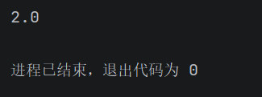
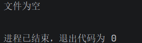
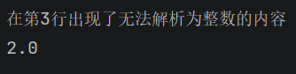
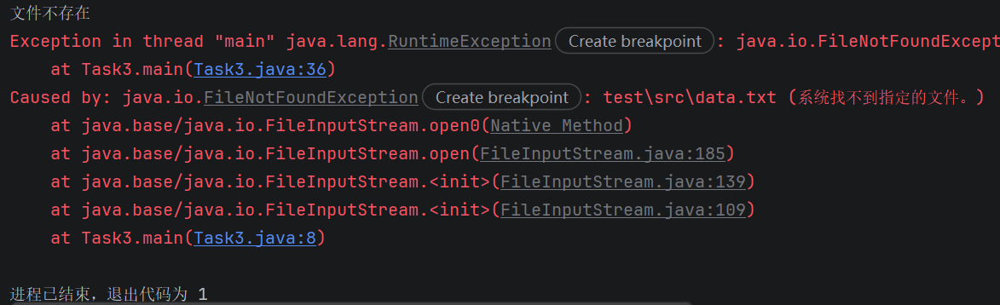

# 微光2026招新-Web后端-02

*（涉及的所有代码和未写在md中的做题过程均分题号放在src/目录下的java文件中）*

*（题目说要交的代码尽量都注入在md里了）*

## Task 1

1. **基本数据类型及表示范围**

| 基本数据类型        | 占用字节 | 表示范围                                   |
| ------------------- | -------- | ------------------------------------------ |
| byte                | 1        | -2^7 ~ 2^7-1                               |
| short               | 2        | -2^15 ~ 2^15-1                             |
| int                 | 4        | -2^31 ~ 2^31-1                             |
| long （以上为整型） | 8        | -2^63 ~ 2^63-1                             |
| float               | 4        | 24位二进制有效位（6~7位十进制有效数字）*   |
| double              | 8        | 53位二进制有效位（15~16位十进制有效数字）* |
| char                | 2        | 0 ~ 65535 （Unicode编码）                  |
| boolean             | 通常为1  | true or false                              |

**`Float.MAX_VALUE`可以表示38位的大整数，但是会丢精，在下面解释。（double同理）*

2. **基本类型与引用类型的区别。**

   - 基本类型就是上面的八种，其他都是引用类型，包括：类、数组、接口等。

   - 关于**赋值**。

     - 对基本类型赋值例如`int a=325;` ，325这个数字就直接到了a这个变量里。

     - 对引用类型赋值如`Integer b=Integer.valueOf(325);`，系统先找了个地方创造一个Integer对象，b只是用来指向那个地址的指针，用来引用对象。

     - 因此 如果我们运行如下代码

       ```java
       int a=325;
       int b=325;
       Integer c=Integer.valueOf(325);
       Integer d=Integer.valueOf(325);
       System.out.println(a == b);
       System.out.println(c == d);
       ```

       输出的结果是true \n false，因为基本类型ab直接比较了值325，但引用类型cd比较的是创造的Integer对象的地址，当然不一样，因此输出了false。

       **此处规避了缓存池的问题，在下面缓冲池部分进一步解释。*

3. ```java
   int a = 4;
   char c = '0';
   int b = a + c;
   ```

   注意到输出结果为52。此时打开调试，会发现c的描述为'0' 48。此处发生了隐式类型转换，即系统自动帮你进行转换（此处把char转换为了int），因此b=a+c=4+48=52。

   - 隐式类型转换遵从“从小到大”的规则：

     - byte→short→int→long→float→double
     - char→int→……

   - 显式类型转换是手动转换，如：

     ```java
     double dps=799.325;
     int result=(int)dps;
     ```

     此时double类型被强制转换为int整型，直接把小数砍掉，即result=799。

4. ```java
   int a = 5;
   int b = 7;
   int c = (++a) + (b++);   //++a表示先自加，再调用a的值；b++表示先调用b的值，再自加。
   						 //计算的顺序是：1.a：5→6  2.c=a+b=6+7=13  3.b：7→8
   System.out.println(c);   //c=13
   System.out.println(a + " " + b);//a=6  b=8
   
   输出：13
       6 8
   ```

5. **解释为什么两个正数相加结果可能变成负数**

   - 我们拿byte类型来举例，byte占1个字节，8位二进制位，其中最高位是符号位，0表示非负，1表示负数。那么byte能表示的最大数就是 0111 1111 （127），此时如果我们给它+1，byte就装不下了（溢出），变成了 1000 0000（-128）。

   - 同理假设我们运行下面这段代码

     ```java
     int a=Integer.MIN_VALUE;
     int b=Integer.MIN_VALUE;
     System.out.println(a+b);
     ```

     输出的结果是0，因为两个intmin（1000 0000 0000 0000 0000 0000 0000 0000）相加后，结果为33位的二进制数（1+后面32个0），但我们的int只能存32位，所以1被扔掉了，结果就是0。

6. **float的精度问题**

   - **float**是单精度浮点数，4字节32位，由1位符号位+8位指数位+23位尾数位。
     * （23位尾数位实则有24位，通常用科学记数法转换后数的格式为1.xxxxxx *2^x，最左边的1系统自动存了，23位尾数位是小数点后的x）
   - 那么假设我们把尾数位全部存满了，例如十进制数123456789，转换为二进制有27位，把它写成科学记数法后是1.11010110111100110100010101 * 2^26，这个时候小数位有26位，超了，**float**就只能把末尾的“101”砍掉，于是就丢精了，最终转换回的十进制数是1.2345679E8，尾数就改变了。

7. ***包装类和缓存池**

   - 在Task1.2中我们提到了基本类型和引用类型的区别，那么**包装类**就是把基本类型变成引用类型的工具，使其能够进入集合、泛型等，或使用一些方法。（上面的Integer就是Int的包装类）

   - **包装类**为了在某种程度上节约一点空间资源，设置了**缓存池**，在**缓存池**内的数值会默认进入同一个对象中。例如Integer的默认缓存范围是'-128~127'，在这个范围内的值会返回同一个对象。如：

     ```java
     Integer c=Integer.valueOf(100);
     Integer d=Integer.valueOf(100);
     System.out.println(c == d);
     ```

     此时输出的结果就是true了。由此我们可以回答Task1.2的*问题，'325'超出了默认缓存池的范围，因此创造的两个Integer对象是不一样的，所以输出的结果是false。
     
     **补充：样例代码的第一部分两个Integer都是18但是输出false，是因为使用了new，创造了两个不一样的对象，没用缓冲池。*

---

## Task 2

1. **关于if-else和switch-case**

   ```java
   boolean isLeapYear(int year) {
           if( (year%4==0&&year%100!=0)||(year%400==0))
           {
               return true;
           }
           else
           {
               return false;
           }
       }
   ```

   

   - 总的来说个人感觉switch-case的应用场景比较有限，但是适合switch-case的场景用起来会比if-else舒服。比如说switch(星期)case周一周二……，当有大量隶属于某个条件的分量时，使用switch-case会是比较好的选择，其余场景都感觉用if比较好。

   - 除去一些特殊用法，传统的switch-case我认为可以算作if-else的语法糖，因为它本质就是省略了case个else。

     特殊用法比如说fall-through穿透，还有查到的一些switch优化如tableswitch，lookupswitch等，可以说是比较跳出了if-else的框架。

2. **循环**

   ```java
   void print(int n) {
           int half=(n-1)/2;
           for (int i=0;i<n;i++){
               for(int j=0;j<Math.abs(half-i);j++){
                   System.out.print(' ');
               }
               if(i==0||i==n-1){
                   System.out.print('*');
               }
               else{
                   System.out.print('*');
                   int mid=2*(half-Math.abs(half-i))-1;
                   for(int j=0;j<mid;j++){
                       System.out.print(' ');
                   }
                   System.out.print('*');
               }
               System.out.println();
           }
   
       }
   输出结果：
     *
    * *
   *   *
    * *
     *
       
   ```

3. **递归与迭代**

   ```java
   //递归
   int fibonacci(int n) {
           if(n==1||n==2)
               return 1;
           else
               return fibonacci(n-1)+fibonacci(n-2);
       }
   ```

   ```java
   //迭代
   int fibonacci2(int n){
           if(n==1||n==2)
               return 1;
           else{
               int a=1;
               int b=1;
               for(int i=3;i<=n;i++){
                   int temp=a+b;
                   a=b;
                   b=temp;
               }
               return b;
           }
       }
   ```

   - 递归的核心是自调用，迭代的核心是循环。

   - 偏好迭代的原因是递归往往会出现重复计算，例如上面n=5时要算f(4)+f(3)，f(4)又要f(3)，重复计算会消耗更多内存与时间。而迭代就是循环，比如上面的就是O(n)直接结束。

   - 循环肯定总能被递归取代，因为他们两个本质上是等价的。例如：

     ```java
     int digui(int i,int n){
         ……………………
         if(i>n){
             return result;
         }
         else{
             return digui(i+1);
         }
     }
     ```

     这样递归就是换了一种方式写循环。

     代价就是上面说的，递归可能会出现额外的空间占用和时间消耗，而且递归如果写成上面那样就是脱裤子放屁，因此简单的循环还是用循环写比较好。但如果分支结构复杂比如树之类的，那么递归的易读性可能会更重要。

4. **汉诺塔**

   - ```java
      public static void hanoi(int n){
             hanoi(n,'A','B','C');
         }
         private static void hanoi(int n,char a,char b,char c)//a通过b把n个盘给c
         {
             if(n==0) return;
             hanoi(n-1,a,c,b);//a通过c把n-1个盘给b；
             System.out.println(a+"->"+c);//a把最大盘给c
             hanoi(n-1,b,a,c);//此时a，b的地位交换了，是一个BAC的n-1层汉诺塔
         }
     ```

---

## Task 3

- **概念问题**

  1. Error是JVM、系统级的问题（比如超内存），Exception是程序运行产生的可预料的异常，通常可以try-catch捕获解决。
     - 严重性：Error>Exception
     - 态度：出现Error要停止运行程序并debug解决，出现Exception可以catch异常让程序继续跑，并尝试在运行的时候处理。（比如网络异常就尝试重新连接）
  2. checked exception和unchecked exception同属于Exception下，前者是编译时异常，一般是外部条件出问题，可以通过catch捕获处理，后者是运行时异常，一般是程序编写不当出现bug，要debug解决。
     - **checked exception**通常由以下原因引起（复制粘贴）：
       - 文件不存在或无法读取：`FileNotFoundException`、`IOException`
       - 网络连接失败、超时：`SocketException`、`ConnectException`
       - 数据库操作失败：`SQLException`
       - 线程被中断：`InterruptedException`
       - 类加载失败：`ClassNotFoundException`
       - 反射找不到方法：`NoSuchMethodException`
     - **unchecked exception**通常由以下原因引起（复制粘贴）：
       - 空指针：`NullPointerException`
       - 数组越界：`ArrayIndexOutOfBoundsException`
       - 类型转换错误：`ClassCastException`
       - 非法参数：`IllegalArgumentException`
       - 算术错误：`ArithmeticException`，如除零
       - 集合越界：`IndexOutOfBoundsException`
       - 并发修改：`ConcurrentModificationException`

- 题目

  ```java
  import java.io.*;
  import java.nio.charset.StandardCharsets;
  public class Task3 {
      public static void main(String[] args) {
          double sum=0;
          int line=0;
          double count=0;
          try (BufferedReader br = new BufferedReader(new InputStreamReader(new FileInputStream("data.txt"), StandardCharsets.UTF_8))){
              String s;
              if((s= br.readLine())==null){
                  throw new EmptyFileException("文件为空");   //自定义异常类判定条件
              }
              while ((s)!=null)
              {
  
                  try {
                      line++;
                      count++;
                      sum+=Integer.parseInt(s);
                  }catch (NumberFormatException e){
                      System.out.println("在第"+line+"行出现了无法解析为整数的内容");
                      count--;
                  }
                  s= br.readLine();
              }
              if(count!=0){
                  System.out.println(sum/count);
              }
              else{
                  System.out.println("无有效数据，无法计算");
              }
          }catch (EmptyFileException e){
              System.out.println("文件为空");
          }catch (FileNotFoundException e) {
              System.out.println("文件不存在");
              throw new RuntimeException(e);
          }catch (IOException e) {
              System.out.println("文件无法读取");
              throw new RuntimeException(e);
          }
      }
      public static class EmptyFileException extends RuntimeException{    //创建自定义异常类
          public EmptyFileException(String s)
          {
              super(s);
          }
      }
  }
  ```
  
  输出结果如下：
  
  - 正常运行：
  - 文件为空：
  - 文件中出现无法解析为整数的内容：
  - 文件不存在：

## Task 4

- 代码题
  
  1. 直接打印limit，得到`limit = java.util.stream.SliceOps$1@3feba861`，打印出来的是limit这个对象本身。
  
  2. 原因是没有上面提到的“终结方法”。
  
     ```java
     List<String> strings = List.of("I", "am", "a", "list", "of", "Strings");
     Stream<String> stream = strings.stream();//获取Stream流
     Stream<String> limit = stream.limit(4);//中间方法：取前四个
     //此处缺少终结方法，流没通
     System.out.println("limit = " + limit);
     ```
  
     就相当于我打开了放水口，管道也连接好了，但是没有通电启动，因此流没有正常开始运输。
  
- 题目（Student在另一个java文件中）

  ```java
  import java.util.Arrays;
  import java.util.List;
import java.util.stream.Collectors;
  import java.util.stream.Stream;
  
  public class Task4 {
      public static void main(String[] args) {
          
          List<Student> students = Arrays.asList(
                  new Student("Alice", 85),
                  new Student("Bob", 58),
                  new Student("Charlie", 90),
                  new Student("David", 45),
                  new Student("Eve", 72),
                  new Student("Frank", 60),
                  new Student("Grace", 55),
                  new Student("Heidi", 95)
          );
          List<String> passingStudents = students.stream().filter(s->s.getScore()>=60).map(Student::getName).sorted().map(String::toUpperCase).collect(Collectors.toList());
          System.out.println(passingStudents);
      }
  }
  
  输出：[ALICE, CHARLIE, EVE, FRANK, HEIDI]
  ```
  
---

## 提交要求3

  在写Task3的题目的时候，我一开始是先br.readLine()判断是否非空，再继续下一步，然后我发现这一步把第一行读掉了。当时我选择的处理方法是把br读进来的字符串当作第一次循环的条件（就是现在代码写的那样），我现在意识到应该可以再开一个流重新读，但这样可能就有点麻烦了。

  还有这个try-catch的囊括范围也是比较头疼的事情，我犯过包括但不限于以下错误：

  - 把readLine放在try里会报错的代码下面，然后无限循环。
  - try-catch在循环外面，读到非整数就跳出去结束循环了。
  - 修修改改然后发现花括号的排版是依托大份:cry:，不小心多删掉一个然后报错。

---

  

## 碎碎念

  虽然这一题才02，但是我做起来远比我想象中吃力。我的学习策略是不系统去学习java的语法（感觉时间有点吃紧），而是遇到了困难直接问ai定向解决。

  *（一开始我为了尽量避免让ai直接生成我要的代码，把问题粘到网页版ds问）*

  拿Task 3的题目部分举例，我大概经历了如下过程：

     1. 要用IO流读文件 → 了解什么是流 → 把05给的BufferedReader搞明白是怎么回事 → 查br的语法（如readLine）
      
     2. 要处理异常 → 了解到try-catch语法 → 问ai问了半天还是感觉一知半解 → 去看了翁凯的java教程异常部分 （这个时候我没意识到后端碎碎念里贴了教程链接）→ 姑且写出来文件不存在和非整数。
      
     3. 问ai怎么自定义异常类 → （然后ai真的只是定义了一个变量名，无言了）→ 追问怎么定义触发条件 → 了解到了延展，抛出 → 修改了几次把 EmptyFileException写好。
      
     4. 然后我发现根本没涉及到用try-with-resources管理 → 问半天没搞懂 → 让内置cc生成代码给我看然后一下子明白了。
      
        *（到这里我就恶堕了，后续02的任务基本都是通过cc学习，效率高了很多）*

  

*ps task3,4涉及到了后面的东西，比如说Stream，List，我看后面会具体研究，所以在本节只弄懂了我做题需要的语法和大致结构，更具体的等后面的题目再深入。

  

  

  
