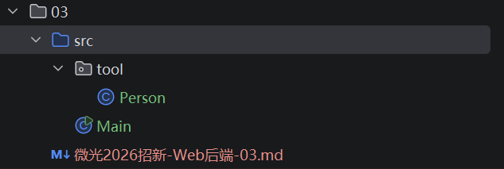
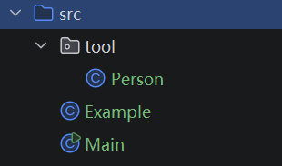

# 微光2026招新-Web后端-03

## Task 1,2

- 任务1,2使用的目录结构如下：

 

- **1.1 复制对象**

```java
//Person.java
public class Person {
    String name;
    int age;
    String gender;
    
    public Person(Person object){
        this.name=object.name;
        this.age=object.age;
        this.gender=object.gender;
    }   
}
```

- **1.2 this**

  - 我们知道在修改实例变量的时候需要指明对象，比如在Main类中`Person p=new Person();`，然后就可以用p指向对象使用`p.name=" "`进行赋值。但是在Person类中我们直接使用`name=" "`来进行初始化或者赋值，那么就可能产生一个问题：

    ```java
    //Person.java
    Person(String name,int age,String gender){
            name=name;
            age=age;
            gender=gender;
        }
    ```

    比如上面这段代码，name=name将会是一个很滑稽的事情，编译器也会分不清楚哪个name是对象的哪个name是输入的（根据就近原则会事与愿违），这时候this就出现了，它指向对象本身。于是代码改写为`this.name=name;`，一目了然谁是被赋值的对象，谁是赋的值。

- **1.3 创建对象并赋值**

  ```java
  //Main.java
  Person p1=new Person(); //创建新Person类对象p1
  p1.name="unknown"; 
  p1.age= 10;
  p1.gender="unknown"; //给p1的三个变量赋值
  Person p2=new Person(p1); //复制p1(方法见1.1)
  Person p3=new Person("name",10,"gender"); //另一种赋值方法(方法见1.2)
  ```

- **1.4 类与对象的关系**

  - 类是一个大的**抽象的**框架，类似于强化版结构体，它有一些属于它的成员变量（如上面的name，age）和特有的方法。
  - 对象是根据类的模版创造出的**具体的**个例，每个对象都可以给自己的实例变量赋特有的值（如p1.name="小明"、p2.name="小红"），也可以调用类中的各种非静态方法。
  - 具体举个例子的话：类就是人类，对象就是具体的每一个人。
  
- **2.2 访问修饰符和访问范围**

  | 访问修饰符/访问范围 | 类内部 | 同一个包的类 | 不同包的子类 | 不同包的类 |
  | ------------------- | ------ | ------------ | ------------ | ---------- |
  | public              | ✅️      | ✅️            | ✅️            | ✅️          |
  | protected           | ✅️      | ✅️            | ✅️            | ❌️          |
  | 默认                | ✅️      | ✅️            | ❌️            | ❌️          |
  | private             | ✅️      | ❌️            | ❌️            | ❌️          |

- **具体说明**

  

  - 现在Example和Main在同一个包（默认）中，Person在tool包中。
  - public就是所有地方都可以访问
  - protected是不能跨包访问，但是可以通过子类访问
  - 默认就是不能跨包访问，比如Main可以访问Example，但不能访问Person
  - private是只能在自己的类里面访问，比如Main的private变量只能在Main里访问

- **2.4 静态变量和方法**

  - 一言以蔽之，静态变量和方法归属于类本身，在类初始化的时候就有了，因此不用new对象而是直接通过类名调用。而实例变量和方法归属于对象，没有对象this就是空指，所以要通过对象调用。实例如下：
  
    ```java
    //Person.java
    public static void eat(){
            System.out.println("I'm hungry");
        }
    public static int num=0;
    public Person(){num++;}
    //Main.java
    Person p=new Person();
    Person.eat();
    System.out.println(num);
  输出：I'm hungry
         1
    ```
    
    ```java
    //Person.java
    public void modify(String name){
            this.name=name;
            System.out.println(this.name);
        }
    
    //Main.java
    p1.modify("name");
  
    输出：name
    ```
    
    其中eat是直属于类Person的静态方法，modify是属于对象new Person()的实例方法。
  
- ***补充**

  - 在我玩的时候，我有一个大胆的想法可以让Main绕过private的限制访问Person的变量，具体如下：

    ```java
    //Person.java
    package tool;
    
    public class Person {
        private String name;
        int age;
        String gender;
        
        public void modify(String name){
            this.name=name;
            System.out.println(this.name);//定义了一个modify方法可以修改对象的名字
        }
    }
    
    //Main.java
    import tool.Person;
    
    public class Main {
        public static void main(String[] args){
            Person p1=new Person();
            p1.modify("name");
        }
    }
    
    输出：name
    ```

    这里发现name明明是一个Person类的private量，但是被Main通过public方法跨包修改了。逻辑上也是说的通的，因为方法是public，之后的运行本质上在Person类里进行，而Person类当然可以访问自己的private变量进行修改。但这样就很神秘，感觉像是private失效了一样。

    - ***二补**
      - 原来这边是无意间实现了封装，没绷住，往下看了一个视频就恍然大悟了。

---

## Task 3

- 我将用一下代码展示我对子类父类的理解：（代码只保留了我需要的部分，Mouse 的代码见 src/animal/Mouse.java（与 Penguin同理，这里省略了），子类行为差异的更完整演示见 Task 4 的图形部分。）

```java
//Animal.java
package animal;

public class Animal {
    protected String name;
    protected int id;
    public Animal(String myName, int myId) {
        name = myName;
        id = myId;
    }
    public void introduction() {
        System.out.println("大家好！我是" + id + "号" + name + "。");
    }
}
//Main.java
public class Main {
    public static void main(String[] args){
        Animal animal1=new Animal("a",1);
        Animal animal2=new Penguin("b",2);
        animal1.introduction();
        animal2.introduction();
    }
```

Animal类和Main全程没变（把private修改为了protected便于访问）

1. ```java
   //Penguin.java
   public class Penguin extends Animal{
       public Penguin(String b, int i) {
           super(b,i);
       }
       @Override
       public void introduction(){
           super.introduction();
           System.out.println("大家好！我是" + id + "号企鹅" + name + "。");
       }
   }
   
   输出：大家好！我是1号a。
   	 大家好！我是2号b。
   	 大家好！我是2号企鹅b。
   ```

2. ```java
   //Penguin.java
   public class Penguin extends Animal{
       String name;
       int id;
       public Penguin(String b, int i) {
           super(b,i);
       }
       @Override
       public void introduction(){
           super.introduction();
           System.out.println("大家好！我是" + id + "号企鹅" + name + "。");
       }
   }
   
   输出：大家好！我是1号a。
   	 大家好！我是2号b。
   	 大家好！我是0号企鹅null。
   ```

3. ```java
   //Penguin.java
   public class Penguin extends Animal{
       String name;
       int id;
       public Penguin(String b, int i) {
           super(b,i);
       }
       @Override
       public void introduction(){
           super.introduction();
           System.out.println("大家好！我是" + super.id + "号企鹅" + name + "。");
       }
   }
   
   输出：大家好！我是1号a。
   	 大家好！我是2号b。
   	 大家好！我是2号企鹅null。
   ```

4. ```java
   //Penguin.java
   public class Penguin extends Animal{
       String name;
       int id;
       public Penguin(String b, int i) {
           super(b,i);
           name=b;
           id=i;
       }
       @Override
       public void introduction(){
           super.introduction();
           System.out.println("大家好！我是" + id + "号企鹅" + name + "。");
       }
   }
   
   输出：大家好！我是1号a。
   	 大家好！我是2号b。
   	 大家好！我是2号企鹅b。
   ```

- 1中，super初始化了父类Animal的name和id，且子类Penguin没有定义自己的name和id，所以输出时直接继承了Anima的name和id。

- 2中，子类Penguin定义了自己的name和id，所以输出时就访问子类自定义的，但是super只会给父类初始化，因此输出的Penguin的name和id是默认值。

- 3中用super.id输出了父类的id，进一步验证了1,2。

- 4中既super给了父类又给子类的变量赋值了，因此输出都是赋值后的。

  

- ***补充**

  ```java
  //Penguin.java
  public class Penguin extends Animal{
      String name;
      int id;
      public Penguin(String b, int i) {
          super(b,i);
  //        name=b;
  //        id=i;
      }
  }
  
  //Main.java
  Animal animal1=new Penguin("a",1);
  Penguin animal2=new Penguin("b",2);
  System.out.println(animal1.id);
  System.out.println(animal2.id);
  
  输出：1 /n 0
  ```

  animal1和animal2都是Penguin对象，在上面调用方法时也都是正常调用的，但是这里可以发现Animal出的对象调用的是super上去的`id=1`，而Penguin出的对象调用的是Penguin中的默认值`id=0`。由此可以看出"取类的变量，看的是编译时类型；取类的方法，看的是运行时类型"。
  
  
  
- **类的多继承**

  - 多继承最麻烦的问题就是容易产生歧义。假设存在如下多继承：

    ```text
        A
       / \
      B   C
       \ /
        D
    ```

    1. 假设bc有同名方法hello，那么访问d.hello() 到底是调用的B的方法还是C的方法？变量名同理。这样就产生了冲突。
    2. 假设bc对a有不同相似构造方法，那么d在创建新对象的时候到底用谁的？
    3. 在个数少的时候，这些问题似乎多加一个参数比如d.B.hello() 就能解决，但是当工程量多了，频繁的多继承就会变成屎山。
    4. *多接口可以弥补无法多继承的缺口。

---

## Task 4

- 抽象类实现

  ```java
  //Shape.java
  public abstract class Shape {
      protected double a,b,c;
      
      public Shape(){}
      public Shape(double r){ //圆形的构造
          this.a=r;//半径
      }
      public Shape(double a,double b){//长方形构造
          this.a=a;
          this.b=b;//长宽
      }
      public Shape(double a,double b, double c){//三角形构造
          this.a=a;
          this.b=b;
          this.c=c;//三边长
      }
      public abstract String id();
      public abstract double perimeter();//计算周长
      public abstract double area();//计算面积
  }
  
  //Main.java
  public class Main {
      public static void main(String[] args){
          Shape[] shapes={new Circle(2),new Rectangle(3,4),new Triangle(3,4,5)};
          for (Shape s :shapes){
              System.out.println(s.id()+"的周长="+s.perimeter()+", 面积="+s.area());
          }
      }
  }
  //抽象类实现
  //未进行数据是否合法的检验，仅作为数据合法情况下的实现
  class Circle extends Shape{
  
      public Circle(double r){super(r);}
      @Override
      public String id(){return "圆";}
      @Override
      public double perimeter() {
          return 2*Math.PI*a;
      }
      @Override
      public double area() {
          return Math.PI*a*a;
      }
  }
  
  class Rectangle extends Shape{
      public Rectangle(double a,double b){super(a,b);}
      @Override
      public String id(){return "矩形";}
      @Override
      public double perimeter() {
          return 2*a+2*b;
      }
      @Override
      public double area() {
          return a*b;
      }
  }
  
  class Triangle extends Shape{
      public Triangle(double a,double b,double c){super(a,b,c);}
      @Override
      public String id(){return "三角形";}
      @Override
      public double perimeter() {
          return a+b+c;
      }
      @Override
      public double area() {
          double p=perimeter()/2;
          return Math.sqrt(p*(p-a)*(p-b)*(p-c));
      }
  }
  
  ```

- 接口类实现

  ```java
  //Shape.java
  public interface Shape {
      double perimeter();
      double area();
      String id();
  }
  
  //Main.java
  public class Main {
      public static void main(String[] args) {
          Shape[] shapes={new Circle(2),new Rectangle(3,4),new Triangle(3,4,5)};
          for (Shape s :shapes){
              System.out.println(s.id()+"的周长="+s.perimeter()+", 面积="+s.area());
          }
      }
  }
  //接口方法
  class Circle implements Shape {
      double r;
      public Circle(double r){
          this.r=r;
      }
      @Override
      public String id(){return "圆";}
      @Override
      public double perimeter() {
          return 2*Math.PI*r;
      }
      @Override
      public double area() {
          return Math.PI*r*r;
      }
  }
  
  class Rectangle implements Shape {
      double a,b;
      public Rectangle(double a,double b){
          this.a=a;
          this.b=b;
      }
      @Override
      public String id(){return "矩形";}
      @Override
      public double perimeter() {
          return 2*a+2*b;
      }
      @Override
      public double area() {
          return a*b;
      }
  }
  
  class Triangle implements Shape {
      double a,b,c;
      public Triangle(double a,double b,double c){
          this.a=a;
          this.b=b;
          this.c=c;
      }
      @Override
      public String id(){return "三角形";}
      @Override
      public double perimeter() {
          return a+b+c;
      }
      @Override
      public double area() {
          double p=perimeter()/2;
          return Math.sqrt(p*(p-a)*(p-b)*(p-c));
      }
  }
  ```

  ```java
  输出：圆的周长=12.566370614359172, 面积=12.566370614359172
  	 矩形的周长=14.0, 面积=12.0
  	 三角形的周长=12.0, 面积=6.0
  ```

  *(两种方法输出一致)*

  区别：抽象类相比于接口，有实例变量；接口相比于抽象类，可以多继承。

  - 因此，当不同对象有很多公用的参量（比如id，name之类的）时，用抽象类比较好，不然接口每次都要重写一遍；反之，用接口比较好。参照上例，在计算圆的时候，只用到了抽象类里的参数a，b和c都是浪费的。以及继承的名额只有一个，但接口可以接任意多个。

---

## Task 5

- private内的内容是被封装起来的，不希望外面直接访问。而public方法提供了一种间接访问的途径，利用封装可以实现让操作者按照”我们希望的途径“进行对private内容的使用。

```java
public class BankAccount {
    // TODO: 修改属性的可见性
    private String accountNumber; //账号
    private String accountHolder; //持有人
    private double balance; //余额
    private String password; //密码

    public BankAccount(String accountNumber, String accountHolder, double initialBalance, String password) {
        // TODO
        if(accountNumber == null){
            throw new IllegalArgumentException("账号不得为空");
        } else if (accountHolder==null) {
            throw new IllegalArgumentException("用户名不得为空");
        } else if (!validatePassword(password)) {
            throw new IllegalArgumentException("密码无效");
        } else if (!validateAmount(initialBalance)) {
            throw new IllegalArgumentException("输入的金额无效");
        }else {
            this.accountNumber=accountNumber;
            this.accountHolder=accountHolder;
            this.balance=initialBalance;
            this.password=password;
        }
    }

    public void deposit(double amount) {//存款
        // TODO
        if(amount>0){
            balance+=amount;
        }
        else {
            System.out.println("Invalid Number");
        }
    }

    public boolean withdraw(double amount, String inputPassword) {//取款
        // TODO
        if(!validateAmount(amount)||!validatePassword(inputPassword)){
            System.out.println("输入无效");
            return false;
        }
        if(!this.password.equals(inputPassword)){
            System.out.println("密码错误");
            return false;
        }
        if(amount<=0){
            System.out.println("金额无效");
            return false;
        }
        if(this.balance-amount<0){
            System.out.println("余额不足");
            return false;
        }
        this.balance-=amount;
        return true;
    }

    public boolean transfer(BankAccount recipient, double amount, String inputPassword) {//转钱
        // TODO
        if (recipient==null){
            System.out.println("账户不存在");
            return false;
        }
        if(!validateAmount(amount)||!validatePassword(inputPassword)){
            System.out.println("输入无效");
            return false;
        }
        if(!this.password.equals(inputPassword)){
            System.out.println("密码错误");
            return false;
        }
        if(amount<=0){
            System.out.println("金额无效");
            return false;
        }
        if(this.balance-amount<0){
            System.out.println("余额不足");
            return false;
        }
        this.balance-=amount;
        recipient.balance+=amount;
        return true;
    }

    public double getBalance() {
        // TODO
        return balance;
    }

    public String getAccountInfo() {
        // TODO
        return "账号："+masknumber(accountNumber)+" 持有人："+maskholder(accountHolder);
    }

    // 只需修改可见性
    private boolean validatePassword(String inputPassword) {
        return true;
    }

    // 只需修改可见性
    private boolean validateAmount(double amount) {
        return true;
    }

    private String masknumber(String account){
        int len=account.length();
        if(len<=8)return "****";
        return account.substring(0,4)+"****"+account.substring(len-4,len);
    }
    private String maskholder(String account){
        return account.substring(0,1)+"**";
    }
}

```

1. 关于只需修改可见性的两行，我没动，也就是假设两个validate正常运行，思路是判断一下输入是否为空以及空格等非法字符、金额是否有效。
2. valid判断都是内部判断，不给外面看，所以是private。
3. 其余的涉及到外部操作的都是public，不然外面访问不了了。
4. 账户信息都是敏感信息，因此都要private。
5. 关于合法账户变量的判定我只判了null，因为这个要根据实际情况决定，具体情况肯定有具体约束条件的。