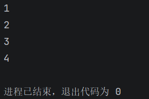
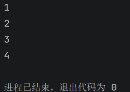
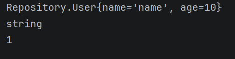
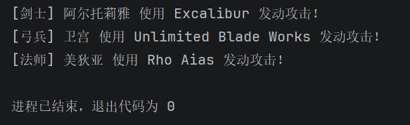

# 微光2026招新-Web后端-04

## Task 1

- **Q1**

  **接口**

  - Collection是集合根接口，下包含List、Set等接口
    - List与Set的区别是：List元素可重复，Set元素不重复
  - Map是映射，与Collection并列，特点是通过唯一key值查询

  **实现类**

  - List
    - ArrayList是动态数组，用下标访问，适合改查
    - LinkedList是双向列表，用指针访问，适合增删
  - Set
    - HashSet本质HashMap，特点是元素唯一但无序，适合查重
    - TreeSet本质TreeMap，特点是元素唯一且有序，可以排序查重
  - Map
    - HashMap基于哈希表，作用是通过key值查询
    - TreeMap基于红黑树，使key值有序，可以范围查询，排序等

  **数组与集合的区别**

  1. 数组的长度是固定的；集合可以扩容
  2. 数组可以存基本类型和对象；集合只能存对象，要包装
  3. 数组的功能较少，消耗内存较少；集合功能丰富，相应消耗内存增加

  

- **Q2**

  ```java
  import java.util.ArrayList;
  import java.util.List;
  
  public class Test {
      static void main(String[] args) {
          List<Integer> list = new ArrayList<>();
          list.add(1);
          list.add(2);
          list.add(3);
          list.add(4);
          for (Integer i :list){
              System.out.println(i);
          }
      }
  }
  
  ```

  输出：

  **第一遍我println里面打印了list，结果把整个list打印了四遍:pray:**

  

- **Q3**

  - **匿名内部类**

    - 因为抽象类或者接口不能直接new一个对象，所以要找一个子类继承它才能正常创建对象。但是这样一直声明新类会显得很冗余，匿名内部类就提供了问题的解决方法，它实际上是生成了一个没有名字的子类，然后再通过这个子类创建新对象进行方法的重写。如样例

      ```java
      list.forEach(new Consumer<Integer>() {
          @Override
          public void accept(Integer integer) {
              System.out.println(integer);
          }
      });
      ```

      实际上就是

      ```java
      //新定义类
      class xxx implements Consumer<Integer>{
          @Override
          public void accept(Integer integer) {
              System.out.println(integer);
          }
      }
      //主函数
      ......
          list.forEach(new xxx());
      ```

  - **函数式接口**

    - 函数式接口+lambda表达式就是对匿名内部类的进一步简化。

    - 四大函数式接口是Consumer<T>,Supplier<T>,Function<T,R>,Predicate<T>，即消费、供给、函数、断言。

    - 看起来似乎不太能感受到这个有什么用，因为它的很多用法都融到了我们常使用的方法里。比较说招新02题中Task4的一行代码

      `List<String> passingStudents = students.stream().filter(s->s.getScore()>=60).map(Student::getName).sorted().map(String::toUpperCase).collect(Collectors.toList());`

      在Stream中，map调用了Function，filter调用了Predicate，使最终代码的实现看起来非常简洁。

  - **lambda表达式**

    - lambda表达式是，在接口中只有一个待实现的非默认方法时，用于简化代码的方法。上面的foreach改写示例如下：

      ```java
      list.forEach(integer -> System.out.println(integer));
      ```

      其中第一个Integer就是forEach要接受的参数，箭头后面的是return语句。如果要写多行，就用花括号展开：

      ```java
      list.forEach(integer -> {
                  System.out.println(integer);
                  return; //void无需return，此处仅作为展示
              });
      ```
      
      输出：

---

## Task 2

- **Q4**

  ```java
  //User.java
  package Repository;
  
  public class User {
      private String name;
      private int age;
  
  
      public User(String name, int age) {
          this.name = name;
          this.age = age;
      }
  
      @Override
      public String toString() {
          return "Repository.User{name='" + name + "', age=" + age + "}";
      }
  }
  
  //Repository.java
  package Repository;
  
  public interface Repository<T> {
      public void save(T t);
      public T getById(Integer id);
  }
  
  //MyRepository.java
  package Repository;
  
  import java.util.HashMap;
  
  public class MyRepository<T> implements Repository<T>{
      private HashMap<Integer,T> hashMap =new HashMap<>();
      private int key=0;
      @Override
      public void save(T t) {
          hashMap.put(key,t);
          key++;
      }
  
      @Override
      public T getById(Integer id) {
          return hashMap.get(id);
      }
  
      public int insert(T t){
          int id=key;
          save(t);
          return id;
      }
      public void foreach(){
          for (T t : hashMap.values()){
              System.out.println(t);
          }
      }
  }
  
  //Main.java
  package Repository;
  
  public class Main {
      static public void main(String[] args) {
          MyRepository<Object> myRepository=new MyRepository<>();
          User user1=new User("name",10);
          myRepository.insert(user1);
          String str="string";
          myRepository.insert(str);
          Integer i=1;
          myRepository.insert(i);
  
          myRepository.foreach();
  
      }
  }
  ```


  输出：



- **碎碎念**

  - 抛开因为写代码不熟练造成的错误，主要遇到了两个问题，都和insert方法的产生有关系。

  - 一个是HashMap的key值问题，我的最初版写的save是两个参数（Integer，T），然后key值就漏在外面，后面我觉得这样子很伪人，因为我创建对象不可能还要自己编号，所以把key值放到了仓库里面藏起来，每次创建对象自己+1，但是这样又出现了一个问题，就是我不知道我创建的对象的key值是多少。所以我又写了一个insert方法让它返回key。

  - 第二个问题是我觉得save应该是个内部方法，所以把它搞成了private，但是接口必须public，所以我搞了个insert，初版是这样的：

    ```java
    public void insert(T t){
        save(t);
    }
    ```
    
    结果发现这是脱裤子放屁。其实在把key写到仓库里面的时候就已经封装好了。外部Main创建对象的时候只知道输入的对象参数，别的信息都是内部的，但是这个insert写都写了，就让它实现了一点别的（见上）

---

## Task 3

- **Q5**

  ```java
  package game;
  // 角色接口
  public interface Character {
      public void attack();
  }
  
  // 剑士实现
  public class Saber implements Character {
      private String name;
      private String skill;
  
      public Saber() {
          this.name = "阿尔托莉雅";
          this.skill = "Excalibur";
      }
  
      @Override
      public void attack() {
          System.out.println("[剑士] "+name+" 使用 "+skill+" 发动攻击！");
      }
  }
  
  // 弓兵实现
  public class Archer implements Character {
      private String name;
      private String skill;
  
      public Archer() {
          this.name = "卫宫";
          this.skill = "Unlimited Blade Works";
      }
  
      @Override
      public void attack() {
          System.out.println("[弓兵] "+name+" 使用 "+skill+" 发动攻击！");
      }
  }
  
  // 法师实现
  public class Caster implements Character {
      private String name;
      private String skill;
  
      public Caster() {
          this.name = "美狄亚";
          this.skill = "Rho Aias";
      }
  
      @Override
      public void attack() {
          System.out.println("[法师] "+name+" 使用 "+skill+" 发动攻击！");
      }
  }
  
  // 角色工厂
  public class CharacterFactory {
      // TODO: 实现工厂方法，根据角色类型返回对应的角色对象
      // 提示：如果传入未知类型，可以抛出 IllegalArgumentException
      public Character getCharacter(String characterType){
          return switch (characterType) {
              case "Saber" -> new Saber();
              case "Archer" -> new Archer();
              case "Caster" -> new Caster();
              default -> throw new IllegalArgumentException("未定义的角色");
          };
      }
  }
  
  // 测试类
  public class Main {
      public static void main(String[] args) {
          // TODO:
          // 1. 通过工厂分别创建 Saber、Archer、Caster 三个角色
          // 2. 让每个角色发动攻击（调用 attack）
          // 期待输出格式参考如下：
          // [剑士] 阿尔托莉雅 使用 Excalibur 发动攻击！
          // ...
          CharacterFactory characterFactory=new CharacterFactory();
          Character saber=characterFactory.getCharacter("Saber");
          Character archer=characterFactory.getCharacter("Archer");
          Character caster=characterFactory.getCharacter("Caster");
          saber.attack();
          archer.attack();
          caster.attack();
      }
  }
  ```

  输出：

- **碎碎念**

  - 这个题做了才发现和我想象中好像差距有点大，重点在工厂创建角色而不是做游戏:smile:
  - 主要遇到的问题是一开始我顺手写的`Saber saber=characterFactory.getCharacter("Saber");`，这样写Character就滚木了，倒反天罡。
  - 这一版没有用到给的枚举类，枚举类的实现的话就是switch那里直接遍历枚举类里的内容，但是没有default就不抛IllegalArgumentException了，所以我没有用。

