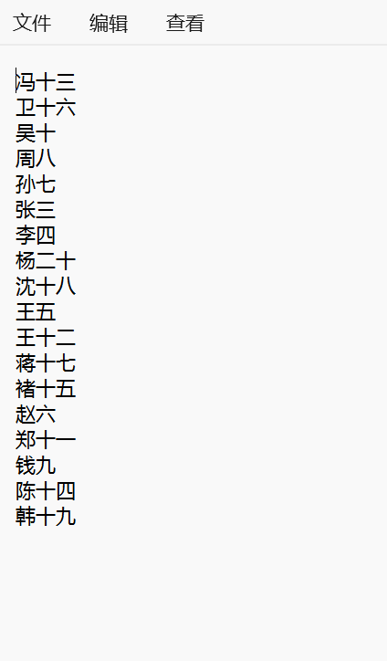
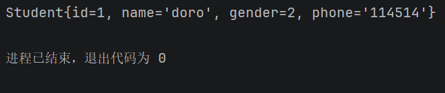
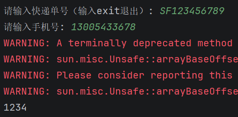
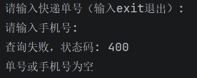
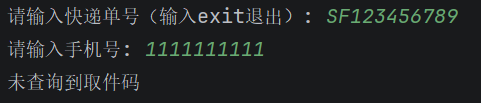
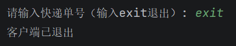

# 微光2026招新-Web后端-05

*索引：*

- *Task1,2的代码在05/src下；素材与输出（doro.jpg、name.txt、doro_copy.jpg、name_sorted.txt、student.dat）在05目录下。*

- *maven项目相关代码在05/PackageSystem/src/main/java/com/test下，本md会复制提交要求中的代码或图片*

- *05下的AI记录是我学习过程中和ClaudeCode的对话，由cc总结生成，主要内容是遇到了什么问题然后是怎么解决的。*

  **（本md会手写一个心得part*）

## Task 1

- 复制图片

```java
import java.io.FileInputStream;
import java.io.FileOutputStream;
import java.io.IOException;

public class File {
    static void main(String[] args) {
        try (FileInputStream fileInputStream = new FileInputStream("doro.jpg");
             FileOutputStream fileOutputStream = new FileOutputStream("doro_copy.jpg")) {
            byte[] bytes=new byte[1024];
            int len;
            //System.out.println(fileInputStream.available());
            while ((len=fileInputStream.read(bytes))!=-1){
                fileOutputStream.write(bytes,0,len);
            }
        }catch (IOException e){
            e.printStackTrace();
        }
    }
}

```

运行结果：

- 姓名表

```java
import java.io.*;
import java.nio.charset.StandardCharsets;
import java.util.ArrayList;
import java.util.Comparator;
import java.util.List;

public class Name {
    static void main(String[] args) {
        try(BufferedReader bufferedReader = new BufferedReader(new InputStreamReader(new FileInputStream("name.txt"), StandardCharsets.UTF_8));
            BufferedWriter bufferedWriter =new BufferedWriter(new OutputStreamWriter(new FileOutputStream("name_sorted.txt"),StandardCharsets.UTF_8))){
            List<String> str=new ArrayList<>();
            String l;
            while ((l=bufferedReader.readLine())!=null){
                if(!l.isBlank()){
                    String trim = l.trim();
                    str.add(trim);
                }
            }
            str.sort(Comparator.naturalOrder());
            for (String line : str){
                bufferedWriter.write(line);
                bufferedWriter.newLine();
            }
        }catch (IOException e){
            e.printStackTrace();
        }
    }
}

```

运行结果：

---

## Task 2

```java
import java.io.*;

public class Main {
    static void main(String[] args) {
        Student student = new Student(1, "doro", 2, "114514");
        try (ObjectOutputStream oos = new ObjectOutputStream(new FileOutputStream("student.dat"));){
            oos.writeObject(student);
        }catch (IOException e){
            throw new RuntimeException(e);
        }

        try(ObjectInputStream ois =new ObjectInputStream(new FileInputStream("student.dat"))){
            Student s= (Student) ois.readObject();
            System.out.println(s);
        } catch (IOException | ClassNotFoundException e) {
            throw new RuntimeException(e);
        }

    }
}

```

输出：


## Task 4

```java
//QueryRequest.java
package com.test;

public class QueryRequest {
    //String json = JSON.toJSONString(obj);                  // 对象 → JSON 字符串
    //User user = JSON.parseObject(json, User.class);        // JSON 字符串 → 对象
    private String trackingNumber;
    private String phone;
    public QueryRequest(String trackingNumber,String phone){
        this.trackingNumber=trackingNumber;
        this.phone=phone;
    }
    public QueryRequest(){

    }
    public String getTrackingNumber(){
        return trackingNumber;
    }
    public String getPhone(){
        return phone;
    }

    public void setPhone(String phone) {
        this.phone = phone;
    }

    public void setTrackingNumber(String trackingNumber) {
        this.trackingNumber = trackingNumber;
    }
}

```

```java
//QueryResponse.java
package com.test;

import com.alibaba.fastjson2.JSON;

public class QueryResponse {
    private String pick_code;
    private String msg;
    public QueryResponse(String pick_code,String msg){

        this.pick_code=pick_code;
        this.msg=msg;
    }
    public QueryResponse(){

    }

    public String getMsg() {
        return msg;
    }

    public String getPick_code() {
        return pick_code;
    }

    public void setMsg(String msg) {
        this.msg = msg;
    }

    public void setPick_code(String pick_code) {
        this.pick_code = pick_code;
    }
}
```

```java
//Server.java
package com.test;

import com.alibaba.fastjson2.JSON;
import com.alibaba.fastjson2.JSONObject;
import com.sun.net.httpserver.HttpExchange;
import com.sun.net.httpserver.HttpHandler;
import com.sun.net.httpserver.HttpServer;

import java.io.IOException;
import java.io.OutputStream;
import java.net.InetSocketAddress;
import java.nio.charset.StandardCharsets;
import java.util.HashMap;
import java.util.Map;

public class Server {
    private static final int PORT = 8000;
    // 模拟快递柜数据：key = 快递单号_手机号，value = 取件码
    private static final Map<String, String> expressMap = new HashMap<>();

    public static void main(String[] args) throws IOException {
        // 初始化一些测试数据
        initializeExpressData();
        // 创建HTTP服务器，监听指定端口
        HttpServer server = HttpServer.create(new InetSocketAddress(PORT), 0);
        // 设置路由和处理程序
        server.createContext("/query", new QueryHandler());
        // 启动服务器
        server.start();
        System.out.println("Server started on port " + PORT);
    }

    private static void initializeExpressData() {
        // 添加一些测试数据
        // 键的构成是  快递单号_手机号
        expressMap.put("SF123456789_13005433678", "1234");
        expressMap.put("JD987654321_19805433168","5678");
        expressMap.put("YT456789123_13905479698","9012");
        expressMap.put("ZT789123456_18505433664","3456");
        // TODO 1: 参照测试数据表，把其余3条数据也加进去
    }

    static class QueryHandler implements HttpHandler {
        @Override
        public void handle(HttpExchange exchange) throws IOException {
            // 非POST请求返回405 Method Not Allowed
            if (!"POST".equals(exchange.getRequestMethod())) {
                exchange.sendResponseHeaders(405, -1);
                exchange.close();
                return;
            }

            try {
                // 读取请求体（请求体是字节流，按UTF-8转成字符串）
                String body = new String(exchange.getRequestBody().readAllBytes(), StandardCharsets.UTF_8);
                // 解析JSON请求，取出单号和手机号
                QueryRequest request = JSON.parseObject(body, QueryRequest.class);
                String trackingNumber = request.getTrackingNumber();
                String phone = request.getPhone();

                // TODO 2: 校验单号和手机号不能为空，不合法就抛异常走400分支
                if(trackingNumber.isBlank()||phone.isBlank()){
                    JSONObject body1 = new JSONObject();
                    body1.put("pick_code", null);
                    body1.put("msg", "单号或手机号为空");
                    String json=JSON.toJSONString(body1);
                    exchange.getResponseHeaders().set("Content-Type","application/json;charset=UTF-8");
                    exchange.sendResponseHeaders(400,json.getBytes(StandardCharsets.UTF_8).length);
                    exchange.getResponseBody().write(json.getBytes(StandardCharsets.UTF_8));
                    exchange.close();
                    return;
                }
                // TODO 3: 用"单号_手机号"拼成key，在expressMap中查询取件码
                String key=trackingNumber+"_"+phone;
                if(!expressMap.containsKey(key)){
                    JSONObject body1 = new JSONObject();
                    body1.put("pick_code", null);
                    body1.put("msg", "未查询到取件码");
                    String json=JSON.toJSONString(body1);
                    exchange.getResponseHeaders().set("Content-Type","application/json;charset=UTF-8");
                    exchange.sendResponseHeaders(200,json.getBytes(StandardCharsets.UTF_8).length);
                    exchange.getResponseBody().write(json.getBytes(StandardCharsets.UTF_8));
                    exchange.close();
                    return;
                }
                String code= expressMap.get(key);
                // TODO 4: 根据查询结果构造QueryResponse
                QueryResponse queryResponse =new QueryResponse(code,"success");
                // TODO 5: 把响应对象序列化成JSON并发送响应（状态码200）
                String json=JSON.toJSONString(queryResponse);
                exchange.getResponseHeaders().set("Content-Type","application/json;charset=UTF-8");
                exchange.sendResponseHeaders(200,json.getBytes(StandardCharsets.UTF_8).length);
                exchange.getResponseBody().write(json.getBytes(StandardCharsets.UTF_8));
                exchange.close();

            } catch (Exception e) {
                // 处理异常，返回400状态码(Bad Request)
                // TODO 6: 返回状态码400和错误JSON {"pick_code":null,"msg":"请求格式错误"}
                QueryResponse queryResponse =new QueryResponse(null,"请求格式错误");
                byte[] bytes=JSON.toJSONBytes(queryResponse);
                exchange.sendResponseHeaders(400, bytes.length);
                exchange.getResponseBody().write(bytes);
                exchange.close();

            }
        }
    }
}
```

```java
//Client.java
package com.test;

import com.alibaba.fastjson2.JSON;
import com.alibaba.fastjson2.JSONObject;

import java.io.BufferedReader;
import java.io.IOException;
import java.io.InputStream;
import java.io.InputStreamReader;
import java.net.HttpURLConnection;
import java.net.URI;
import java.net.URL;
import java.nio.charset.StandardCharsets;
import java.util.Scanner;

public class Client {
    private static final String SERVER_URL = "http://localhost:8000/query";

    public static void main(String[] args) {
        Scanner scanner = new Scanner(System.in);
        while (true) {
            try {
                // 读取用户输入的快递单号
                System.out.print("请输入快递单号（输入exit退出）: ");
                String trackingNumber = scanner.nextLine().trim();
                // TODO 1: 输入exit时退出循环（
                if (trackingNumber.equals("exit")){
                    break;
                }

                // 读取用户输入的手机号
                System.out.print("请输入手机号: ");
                String phone = scanner.nextLine().trim();

                // TODO 2: 用fastjson构造json格式的请求体，样例为
                // {"trackingNumber":"SF123456789","phone":"13005433678"}
                String json=JSON.toJSONString(new QueryRequest(trackingNumber,phone));

                // TODO 3: 创建HttpURLConnection，把上面的json写入请求体并发送HTTP POST请求
                // （注意：连接对象要命名为connection，下面判断状态码要用）
                URL url= URI.create(SERVER_URL).toURL();
                HttpURLConnection connection=(HttpURLConnection) url.openConnection();
                connection.setRequestMethod("POST");
                connection.setDoOutput(true);
                connection.setRequestProperty("Content-Type","application/json;charset=UTF-8");
                connection.getOutputStream().write(json.getBytes(StandardCharsets.UTF_8));

                // 读取响应，状态码是200才是响应成功
                if (connection.getResponseCode() == 200) {
                    // TODO 4: 读取响应体并解析json，拿到取件码就打印取件码，
                    // 拿不到就打印msg的内容。响应样例：
                    // {"pick_code":"1234","msg":"success"}
                    // {"pick_code":null,"msg":"手机号不正确"}
                    InputStream inputStream=connection.getInputStream();
                    String s=Client.readBody(inputStream);
                    JSONObject jsonObject=JSON.parseObject(s);
                    String code=jsonObject.getString("pick_code");
                    if (code!=null){
                        System.out.println(code);
                    }
                    else {
                        System.out.println(jsonObject.getString("msg"));
                    }
                } else {
                    InputStream inputStream=connection.getErrorStream();
                    String s=Client.readBody(inputStream);
                    JSONObject jsonObject=JSON.parseObject(s);
                    System.out.println("查询失败，状态码: " + connection.getResponseCode());
                    System.out.println(jsonObject.getString("msg"));

                }
                connection.disconnect();
            } catch (IOException e) {
                // 请求发生错误（比如Server没启动），打印错误信息后继续循环
                System.out.println("请求发生错误: " + e.getMessage());
            }
        }
        scanner.close();
        System.out.println("客户端已退出");
    }

    /** 读取响应体：把InputStream按UTF-8读成一个字符串 */
    private static String readBody(InputStream is) throws IOException {
        StringBuilder sb = new StringBuilder();
        try (BufferedReader reader = new BufferedReader(new InputStreamReader(is, StandardCharsets.UTF_8))) {
            String line;
            while ((line = reader.readLine()) != null) {
                sb.append(line);
            }
        }
        return sb.toString();
    }
}
```

**输出截图：**

- 正常取件：
- 空号：
- 号码错误：
- 退出：


## 思考与心得

​	本part的心得主要写一下我体验下来关于AI coding的事情。

0. 我目前还未让ai直接动我的作业代码，更多是问ai应该我应该做什么，或者我缺少的工具有什么，以及debug

   拿Task4举例，我会先根据ToDo提示把自己能写的东西写完，然后再学新的东西。（AI记录里保留了初代代码）

1. 在我看来，ai的知识库对于我现阶段遇到的问题是可以全部轻松解决的，我遇到的最大的问题有两个，一是存在一些“默认的东西”，ai不会告诉我，我也不知道，就像大学老师说的“这个你们高中都学过的一样”；二是ai本身的“正确率”并没有那么高，经常遇到下一轮对话中ai自己review出了前面的问题，或者我自己编译运行的时候发现新的问题，再反馈给ai进行改进。下面用Task4的例子说明：

- 关于问题一，有一个很糖的事情，就是我代码完工了之后，运行客户端然后查不了取件码，但是ai自己编译的时候是全通过的，那么问题出在哪里呢——我没开服务端，虽然这个事情很搞笑但是我当时还是思考了一会为什么ai过了我没过。

- 关于问题二，我就举报错信息的事情。一开始根据题目的代码只要查失败了就返回`查询失败，状态码: 400`，这就导致我写了半天的不同场景的报错msg完全是滚木，死代码，照理来说ai review的时候应该是可以发现这个问题的，但是这个问题是我实操了之后才发现的，就有种虽然ai什么都知道我不问它就不说的感觉。

  （不过话又说回来要是ai直接一键debug完了那我就一点探索环节都没有了）:smile:

