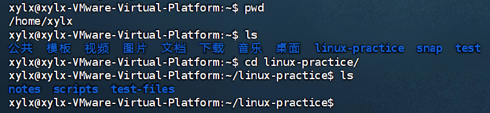
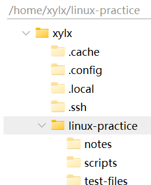
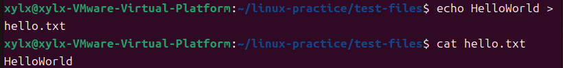
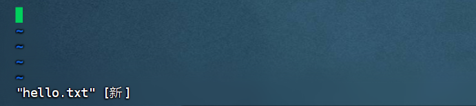
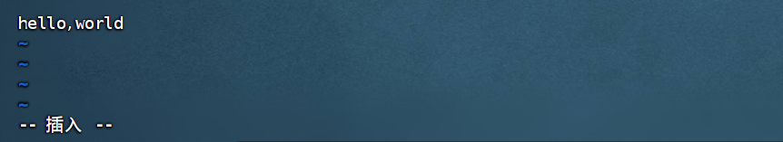
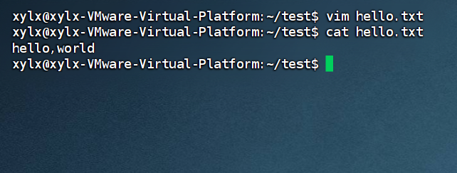
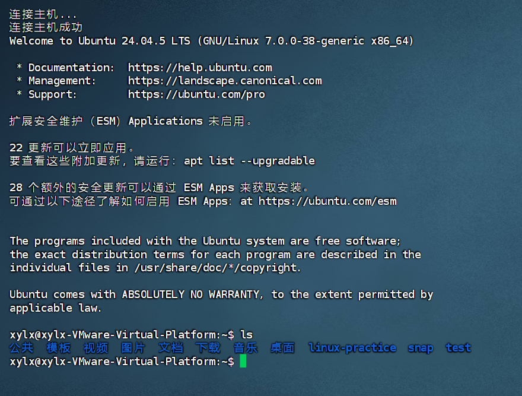
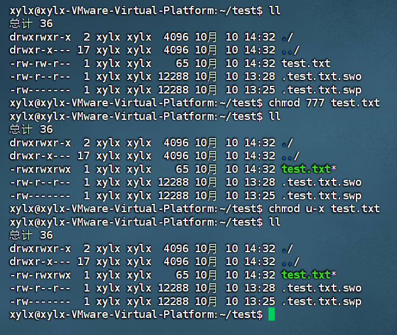

# 微光2026招新-Web后端-06

## Task 1

1. **Ubuntu桌面截图**

2. **Linux发行版**

   Linux发行版就是集成了Linux内核的一个完整操作系统。发行版与Linux的关系就好比小米，OPPO，vivo等与Android的关系。

   不同发行版的差异具体体现在图形化界面不太一样，命令有的不同。

   - 举个例子：我一开始看的黑马的Linux教程（就是题目给的链接），他用的是CentOS。其中他讲到可以`su root`切换到root用户，但是在Ubuntu中这么写会要求我输入root的密码，而这个密码是不存在的，于是会认证失败。可以体现这两个不同发行版的差异。

3. **网络连接方式**

   - NAT模式：最常见的模式，虚拟机可以通过主机访问外网，但外网不能访问虚拟机，主机相当于一台路由器。
   - 桥接模式：相当于另一台主机，可以访问外网，外网也可以访问虚拟机。
   - 仅主机模式：顾名思义此时虚拟机不能与外部进行通信，只能和宿主机和其下的其他虚拟机连接。

---

## Task 2

0. **Linux目录结构**

   Linux没有盘符，只有一个根目录'/'，根目录下面：

   | 目录   | 作用                                |
   | ------ | ----------------------------------- |
   | /bin   | 基本命令                            |
   | /boot  | 启动相关文件                        |
   | /dev   | 设备文件                            |
   | /etc   | 系统文件                            |
   | /home  | 用户家目录（~）一般都在这里进行操作 |
   | /lib   | 系统库文件                          |
   | /media | U盘等可移动设备                     |
   | /mnt   | 临时挂载                            |
   | /opt   | 第三方软件                          |
   | /proc  | 进程和内核信息                      |
   | /root  | root的home                          |
   | /run   | 运行数据                            |
   | /sbin  | 系统管理命令                        |
   | /snap  | Snap软件包                          |
   | /srv   | 服务提供的数据                      |
   | /sys   | 硬件和内核信息                      |
   | /tmp   | 临时文件                            |
   | /usr   | 系统级程序、库、文档                |
   | /var   | 变化数据                            |
   
1. **创建结构：**（当时Linux里截的图感觉效果不好，用finalshell重新弄的）

   

2. **文件**

   （vim的部分写在Task 3）

   

3. **指令**

   | 指令   | 作用                     | 语法                                                         |
   | ------ | ------------------------ | ------------------------------------------------------------ |
   | echo   | 输出后面的内容           | echo sth.                                                    |
   | sleep  | 等待                     | sleep time                                                   |
   | cd     | 进入目录                 | cd 地址（绝对/相对）                                         |
   | ls     | 查看当前目录下的内容     | -a 打印隐藏内容    -l 以详细列表打印    -F 显示类别指示符    -h直观显示文件大小 |
   | (ll)   | ls别名                   | 即ls -alF                                                    |
   | pwd    | 显示当前目录的绝对路径   | pwd                                                          |
   | cat    | 查看文件(全部内容)       | cat 文件                                                     |
   | mkdir  | 创建目录                 | mkdir test                                                   |
   | touch  | 创建文件                 | touch test.txt                                               |
   | cp     | 复制                     | cp 地址1 地址2            -r 递归复制目录                    |
   | mv     | 移动、重命名             | mv 地址1 地址2                                               |
   | rm     | 删除                     | -i 每次删除前询问    -I 删除前统一询问    -f 强制删除，不询问    -d 删除空目录    -r 递归删除目录 |
   
   | 指令   | 作用                     | 语法                                                         |
   | ------ | ------------------------ | ------------------------------------------------------------ |
   | less   | 分页查看文本             | -N 显示行号    -S 不断行    +行号：从指定行开始    +/字符串：查找第一次出现 |
   | head   | 查看文件头部             | -n 行数：显示行数                                            |
   | tail   | 查看文件尾部             | -n 行数：显示行数    -f 持续跟踪输出                         |
   | vim    | 文本编辑器               | vim 地址                                                     |
   | whoami | 查看当前用户名           | whoami                                                       |
   | id     | 查看当前用户信息         | id                                                           |
   | groups | 查看当前用户所属组       | groups                                                       |
   | passwd | 修改密码                 | pwsswd 用户名                                                |
   | su     | 切换用户                 | su 用户名                                                    |
   | sudo   | 借用root权限             | sudo 命令                                                    |
   | chown  | 修改对象的所有者和用户组 | chown 所有者:用户组                                          |
   | chmod  | 修改对象权限             | **字母式**：'chmod [用户类] [操作类型] [权限] [操作对象]'    |
   |        |                          | u所有者    g所属组    o其他用户    a所有用户                 |
   |        |                          | +增加权限    -移除权限    =将权限设置为                      |
   |        |                          | 例：chmod u+x test.txt 给所有者添加执行权限                  |
   |        |                          | **数字式**：rwx一共8种组合方式对应数字0~7    如--- → 000 → 0、rwx → 111 → 7 |
   |        |                          | 例：chmod 777 test/    将test目录的权限设为rwxrwxrwx         |
   | apt    | 管理软件包               | sudo apt install/research/remove 包名                        |
   
   **/***
   
   | 快捷键       | 作用                |
   | ------------ | ------------------- |
   | ctrl+c       | 终止命令            |
   | Home         | 移动到命令头        |
   | End          | 移动到命令尾        |
   | ctrl+←/→     | 向左/右移动一个单词 |
   | ctrl+insert  | 复制                |
   | shift+insert | 粘贴                |
   | ctrl+l       | 清屏（/clear）      |
   
   

---

## Task 3

1. **示例**

   

   

   

   

2. **速查表**

   | 命令    | 作用                       |
   | ------- | -------------------------- |
   | Esc/i   | 普通模式/插入模式          |
   | :wq     | 保存（w）并退出（q）       |
   | :q!     | 不保存退出                 |
   | gg      | 文件头                     |
   | G       | 文件尾                     |
   | x       | 删一个字符（backspace是←） |
   | dd      | 删一行                     |
   | dw      | 删一个词                   |
   | /       | 查找                       |
   | n       | 下一个                     |
   | u       | 撤销                       |
   | yy      | 复制整行                   |
   | p       | 粘贴                       |
   | dd p    | 相当于剪切一行然后粘贴     |
   | gg=G    | 格式化整个文件             |
   | :set nu | 显示行号                   |

---

## Task 4

1. **IP与端口**

   我的理解是：ip是宏观定位，端口是微观定位。ip负责找到这台主机，端口负责找到具体的服务。一次完整的通信需要ip和端口配合使用。现在的应用层面通过域名等大幅简化了大众访问需求，不用记地址和端口，比如我直接www.baidu.com其实默认了端口443，访问www.baidu.com:443结果是一样的。但是在shell层面的连接ip和端口就缺一不可了。

2. **远程连接**

   

   远程连接的方便之处在于：

   - 虚拟机通常运行在比如说公司机房这种地方，而不是自己的电脑上，远程连接不仅使个体操作更方便，也使多人同时操作更方便。
   - 就算是本机的虚拟机，反复ctrl+alt，ctrl+G的切换也非常麻烦，用远程连接可以减少切换的操作量且便于传输文件。

---

## Task 5

1. **root用户与用户组**

   - root用户就是老大，拥有最高权限。可以进行系统级操作，给用户授权、分组等。
   - 用户组就是多个用户的集合，便于统一分配权限。一个用户可以进多个组。
   - 对于Ubuntu，第一个注册的用户会被加入sudo组，被授予了sudo权限。以此可以使用`groupadd`等命令创建组并修改属性，`useradd`等命令创建用户并修改属性。

2. **危害**

   正是因为root太过强大所以不能随便乱用。一个小失误可能就会摧毁整个系统。比如rm -rf的时候多打了一个空格，直接删除根目录，那系统就再见了（不过这个现在会被拦下来，就是类似的小失误酿成大错）。而sudo调用权限的本身也是一种提醒，告诉你接下来的命令比较重要，如果一直开着root会逐渐麻痹这一点，等到出事就来不及了。而且sudo的使用方便查日志管理，谁什么时候调了sudo干了什么一目了然，如果root常开那都是老大就管不了了。

   

3. **chmod**（数字简化在速查表中）

   

   